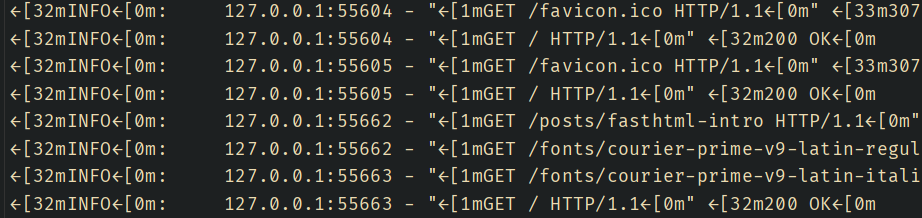
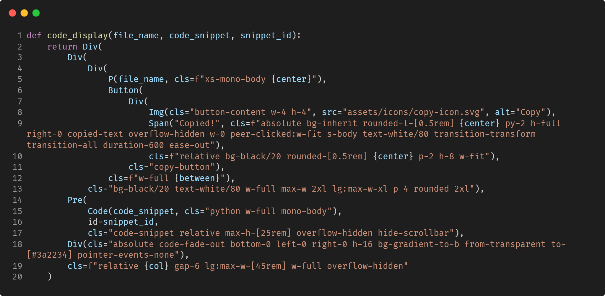
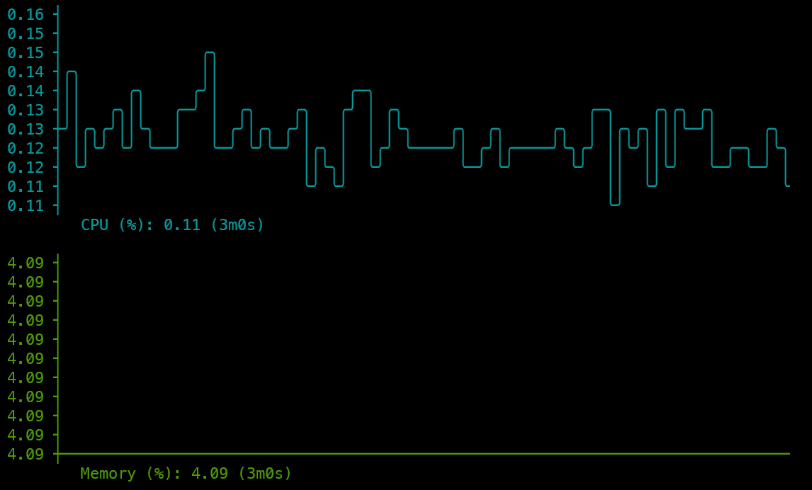
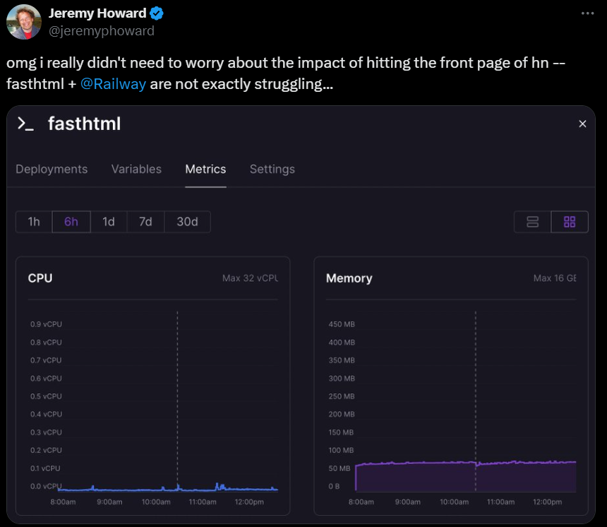

# How FastHTML sparked my joy in web development

I've been wanting to create a personal site for a while now. 
Nowadays, there are basically two options: Either build a full-scale web project with JavaScript/TypeScript and React/NextJS or using a static site generator like Jekyll or Hugo. 
The first option can become overwhelmingly complex, especially for someone like me, who is not a web developer.
It feels like everyone prefers (and recommends) the most sophisticated setup to accomplish something, even if it should be rather simple in principle.
For instance, you should use Typescript over JavaScript and transpile the code, use a huge framework like NextJS, bun over npm, and so on.
Even something as simple as styling a site is overloaded with [so many options](https://nextjs.org/docs/app/building-your-application/styling) of varying complexity, that it is hard as an outsider to get started.

Naturally, this lead me to the latter, with me trying out [Hugo](https://gohugo.io/), which is a static site generator.
That means that you install the hugo binary, write your content in markdown, and then run `hugo` to generate the site, resulting in plain HTML files.
The setup is easy and in mere minutes, a static site is created and running.
Hugo has a lot of third-party [themes](https://themes.gohugo.io/), which can be easily installed and used.
However, Hugo requires you to conform to their setup, minimizing the flexibility of the site.
Furthermore, debugging errors is hard, as a lot of things are abstracted away from the user.

As luck would have it, just as I was looking for alternatives to these problems, the Answer.ai team around Jeremy Howard released [FastHTML](https://fastht.ml/), which is described as "a new way to create modern interactive web apps".
FastHTML is built on top of [Starlette](https://www.starlette.io/) and [uvicorn](https://www.uvicorn.org/), meaning people which are familiar with FastAPI will feel right at home.
Aside from the technology, using FastHTML feels like using PHP, as you write the HTML tags using Python, with each tag being a simple function:

```python
from fasthtml.common import *
page = Html(
    Head(Title('Some page')),
    Body(Div('Some text, ', A('A link', href='https://example.com'), cls='myclass')))
print(to_xml(page))
```

This simple example is easily readable and understandable, which results in this HTML code:
```html
<!doctype html>

<html>
  <head>
    <title>Some page</title>
  </head>
  <body>
    <div class="myclass">
Some text, 
      <a href="https://example.com">A link</a>
    </div>
  </body>
</html>
```

FastHTML is more than just a simple HTML generator, as it also offers a full-blown webserver with routing, making it pretty easy to start a simple site with very little code and then scale it up as needed.
For interactivity, they support [htmx](https://htmx.org/), which, as an outsider to the JS world, feels more intuitive than other frameworks, as it adds attributes to the HTML tags for interactivity.
This site is built with FastHTML, with the whole code being available [on GitHub](https://github.com/Xceron/florianbrand.de).

Now that we've covered the basics, let me share my personal experiences with this new framework.

## Initial Hurdles

Being a new framework, FastHTML naturally has less (third-party) resources to learn the ins and outs of the framework.
However, the community is growing fast, with multiple projects and examples showing the usage of the library few days after the initial release.
I have compiled a small list [down below](#resources).

While coding in FastHTML, I ran into a few quirks. 
One that stood out was a bug in PyCharm related to the live reload feature. 
FastHTML normally lets you see changes instantly when you save a file, which is very convenient for local development. 
But in PyCharm, this feature does not work correctly, as changes either don't apply or take ages to show up. 
Turns out it's a [known bug](https://youtrack.jetbrains.com/issue/PY-60962/os.killpid-signal.CRTLCEVENT-ignored-when-running-python-program-from-Pycharm), which is not yet fixed.
A workaround is to open the run configuration and enabling the option `Emulate terminal in output console` (hidden under `Modidy options`).[^pycharm]
This will, however, make the terminal output harder to read, as the ANSI escape sequences, which are used for colored output, are displayed and not rendered.
{: style="width: 100%;" }

Speaking of editors: At first glance, FastHTML code looks unconventional in a Python editor.
This unconventional look is due to two main factors. First, the recommended way to import most of FastHTMLs' functionality with `from fasthtml.common import *`. Second, the fact that (nested) HTML tags take up a lot of space rather fast means that they take up a lot of visual space.
The first issue results in linters like pylance or ruff not liking the code, as PEP8 recommends to import only the needed functions[^imports].
To illustrate the second issue, here is some code of the FastHTML landing page:
{: style="width: 100%;" }

While it is valid code, it *feels* weird to see inside a Python file and gets some time to get used to.

Overall, these are not really issues in the power of the AnswerAI team, which underlines how great the framework already is and the overall potential of FastHTML.

## Becoming productive with FastHTML

Admittedly, I needed some time to get started with FastHTML.
This is not a problem of the framework, as my capabilities as a web developer are rather limited and I am a bit rusty when it comes to writing "pure" HTML/CSS.
But after it clicked, it truly is pleasant to use and you can iterate very fast.
For the frontend/HTML, my workflow is making a screenshot of the current page, drawing on top of it with changes I want to apply, and then giving this screenshot with the generated HTML and CSS file to Claude.
Claude then generates the changes by writing HTML, which I then convert with [h2f.answer.ai](https://h2f.answer.ai/) and add to my Python file.
Therefore, it is not really a problem that LLMs don't have knowledge of FastHTML, because it is so close to just HTML.
This also applies to htmx, which has been around for over 10 years and is a well-established framework.
Consequently, the Python code of FastHTML pages is easily readable, which makes learning even easier once you know the basics.
For the backend, FastHTML builds on top of Starlette and uvicorn, which are both well established with a lot of resources available.
For instance, when I needed to redirect to the home page on a 404 error, I simply provided Claude with the context that FastHTML uses these frameworks. Claude then generated code using exception handlers and a RedirectResponse ([Code](https://github.com/Xceron/florianbrand.de/blob/c273a5ea6e181891685d6d06336edbc5c0a5b93e/main.py#L21)).

Beyond the coding aspects, FastHTML impresses with its minimal resource requirements.
I run this site on a small VPS (2 vCores, 2GB RAM, more context in the [deployment section](#deployment)).
When idle, the usage looks like this[^usage]:
{: style="width: 100%;" }

Of course the idle state of a small site is not impressive.
Hitting the front page of hackernews and handling it without breaking a sweat, however, is:
{: style="width: 100%;" }

## Resources

There are already some amazing resources to get started with FastHTML:

* Official materials
      * The comprehensive [documentation](https://docs.fastht.ml/)
      * The [introduction video](https://youtu.be/Auqrm7WFc0I?si=gzU0fe2kcdXwpAX7) from Jeremy Howard, offering a general overview
      * An [interview](https://youtu.be/WuipZMUch18) with the HTMX creator Carson Gross, offering a look into the interactivity provided by HTMX and their vision of the framework(s)
* Tutorial content
      * CalmCode's [video tutorial](https://youtu.be/4En57Zw6gU4?si=ehYOIhzdYj0itouf) on building interactive charts with matplotlib and htmx
      * A [heavily commented example](https://gist.github.com/jph00/26200368915f6aabb450eaf33a03c3e8), perfect for providing context to a LLM
* Tools and examples
      * [h2f.answer.ai](https://h2f.answer.ai/) for converting HTML tags to FastHTML functions
      * [FastHTML.Gallery](https://fasthtml.gallery/) for minimal implementations of web components
      * Code of several real-life examples, including the [FastHTML landing page](https://github.com/AnswerDotAI/home-fasthtml), the [About FastHTML website](https://github.com/AnswerDotAI/fh-about), (which uses [fh-bootstrap](https://github.com/AnswerDotAI/fh-bootstrap)), and this very [site](https://github.com/Xceron/florianbrand.de)!
* Community support
      * The #fasthtml channel on the [FastAI Discord](https://discord.gg/qcXvcxMhdP)

## Deployment

I've deployed the site on a VPS from netcup. For just €3.99 per month, I get 2 vCores, 2GB RAM, and a 64GB SSD ([link](https://www.netcup.eu/bestellen/produkt.php?produkt=3899)). 
This is a fantastic deal, especially when compared to cloud providers like AWS. 
These services often charge 3-5 times more for similar resources and can be more complex to set up. Platform-as-a-Service (PaaS) options like Railway, Heroku, and Vercel are easier-to-use alternatives, but they can become costly if your site experiences high traffic.
Personally, I find easier to manage and use a VPS, which I can ssh into to set up my things, such as this blog, compared to a service which tries to abstract this away from me. 

FastHTML offers various [templates](https://docs.fastht.ml/tutorials/deployment.html) to deploy the site for popular providers. As there is no guide for a generic, self-hosted setup, so here is my setup:

* A (public) git repository with the code of the server, which is available [here](https://github.com/Xceron/florianbrand.de). As the site only consists of (Fast)HTML, CSS and markdown files with a very basic routing scheme, it is okay to have the code public. The default should be a private repository. 
* Docker with docker compose to build and run FastHTML and the associated server, which can be accessed [here](https://github.com/Xceron/florianbrand.de/blob/main/Dockerfile)[^docker]. While it is not necessary to use Docker, it makes the setup easier and more reproducible between the local development machine and the VPS.
* [Caddy](https://caddyserver.com/), which is an alternative to nginx and acts as a reverse proxy and web server. It is easier to set up and configure than nginx, as it has automatic HTTPS and a simple configuration file.

The process to deploy the site is as follows:

1. ssh into the VPS server
2. Install Docker and Docker Compose
3. Clone the repository of the site
4. Create a file named `Caddyfile` with the configuration for the site
5. Create a file named `docker-compose.yml` with the configuration for the FastHTML server and the Caddy server
6. Run `docker-compose up --build -d` to build and run the FastHTML server and the Caddy server


The `Caddyfile` for an exemplary page at `yourpage.com` would look like this:
```
YOURPAGE.com, www.YOURPAGE.com {
    reverse_proxy fasthtml-app:5001
}
```

The `docker-compose.yml` file would look like this:
```yaml
services:
  caddy:
    image: caddy:latest
    ports:
      - "80:80"
      - "443:443"
    volumes:
      - ./Caddyfile:/etc/caddy/Caddyfile

  fasthtml-app:
    build:
      context: ./<PATH TO THE LOCAL REPOSITORY>
      dockerfile: Dockerfile
    container_name: fasthtml-app
```

This is everything needed for the deployment. The site should be available at `yourpage.com` and `www.yourpage.com` with automatic HTTPS being set up by Caddy.

## Final Thoughts

For me, FastHTML has filled a desire I had for a long time: A simple way to create websites, without requiring me to learn the complexity which is modern web development.
I never thought I'd be using Python like PHP, but it is a welcome change and being able to tap into the vast ecosystem of Python libraries is a huge plus.
For now, I don't think FastHTML will replace (my usage of) gradio and streamlit, which make it easy to create good-looking MVPs in a mere minutes with few lines of code.
This could change, however, if the community grows and makes components easily available, which would make it easier to create more complex sites with less code.
In the community discord, there are people from different backgrounds: Data scientists, which want to create beautiful dashboards, web developers, which want to have a simpler way to create websites,  Django powerusers, which know everything about Python web development and server, and many more.
I will watch the development of FastHTML closely and can't wait to see where the framework will be in a year or two.

[^pycharm]: Alternatively, you can use VSCode/Cursor or run it in your terminal, which all work perfectly fine with live reloading, also on Windows.
[^imports]: There is an [example](https://github.com/AnswerDotAI/fasthtml/blob/main/examples/pep8_app.py) of a PEP8 conform app.py with `from fasthtml import common as fh`, which then results in a lot of `fh.` in the code, making it less readable. Alternatively, you could also import every used HTML tag, but this results in ~20 lines of imports rather quickly.
[^usage] Screenshot done with the amazing [lazydocker](https://github.com/jesseduffield/lazydocker) tool
[^docker]: The Dockerfile uses [uv](https://github.com/astral-sh/uv) to install the python dependencies instead of pip. uv is much faster than pip, but is not part of the Docker images, so it has to be installed first.