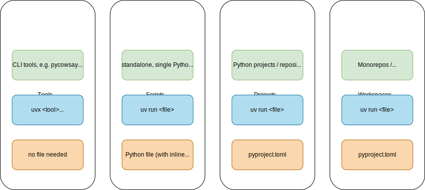
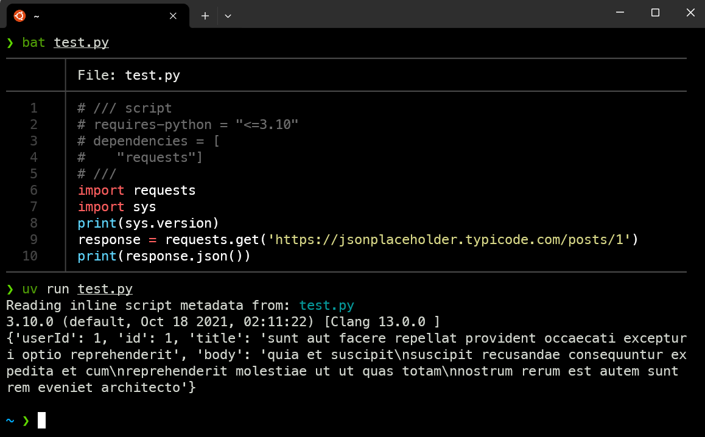

# Sane Python dependency management with uv

Astral, the company behind the fast and beloved python linter [ruff](https://astral.sh/ruff) has been working on [uv](https://github.com/astral-sh/uv) for some time now, with the ambitious goal to bring the philosophy of cargo, rusts package manager, to the python ecosystem.
Personally, I have never been a fan of alternative package managers and tools like conda, poetry, pipx and others, as they require you to install a whole tool for a certain use case, addressing only a single pain point.
However, uv is different, and I've been using it for some months now as a replacement for pip.
uv offers a very noticeable speedup for installing packages, even on small projects, while using the same commands as pip.
Some projects are already switching their pipelines and report big speedups, e.g. streamlit reducing their load time up to [55%](https://blog.streamlit.io/python-pip-vs-astral-uv/) or Google having a [2-5x speedup](https://x.com/cgarciae88/status/1826589523020595546) on their CI/CD pipelines for a JAX library.

With [uv 0.3.0](https://astral.sh/blog/uv-unified-python-packaging), Astral is targeting more than just pip and want to provide a unified interface for all python packaging needs, from CLI tools to complicated projects spanning multiple packages. 
This post is meant as a small introduction into `uv` to showcase some of the features, everything else can be found in the [documentation](https://docs.astral.sh/uv/).

## Installation
Installing uv is pretty easy:
```bash
curl -LsSf https://astral.sh/uv/install.sh | sh
```
On Windows, it can be installed with PowerShell as follows:

```powershell
powershell -c "irm https://astral.sh/uv/install.ps1 | iex"
```

## Usage

### pip commands

The easiest way to get started with uv is to use the [pip interface](https://docs.astral.sh/uv/pip/).
To do this, simply replace any `pip` command with `uv pip`, e.g. `uv pip install requests` instead of `pip install requests` or `uv pip freeze` instead of `pip freeze`.
This way, you gain the speedup of uv without having to learn any new commands or other tools.
You can also use uv with [existing venvs/projects](https://docs.astral.sh/uv/pip/environments/#discovery-of-python-environments), making the switch to uv very easy. 

### uv commands

Aside from the pip interface, uv also offers its own commands, which are more powerful and can be used to manage your python projects.
For projects, the following commands are of importance when working with python projects:

| uv command             | pip command(s)                                                            | Notes                                                                                                                                       |
|------------------------|---------------------------------------------------------------------------|---------------------------------------------------------------------------------------------------------------------------------------------|
| `uv init <name>`       | N/A                                                                       | creates a new, empty project according to the `pyproject.toml` specification                                                                |
| `uv venv`              | `python -m venv .venv`                                                    |                                                                                                                                             |
| `uv add <package>`     | `pip install <package>`                                                   | uv also adds it to the pyproject.toml, similar to `poetry add <package>`, which pip does not                                                |
| `uv remove <package>`  | `pip uninstall <package> && pip freeze > requirements.txt`                |                                                                                                                                             |
| `uv sync`              | `pip freeze \| xargs pip uninstall -y && pip install -r requirements.txt` | uv also creates a venv if it doesn't exist                                                                                                  | 
| `uv run <python_file>` | `source .venv/activate && python <python_file>`                           | uv can also work with inline dependencies, removing the need for a venv directory ([Docs](https://docs.astral.sh/uv/reference/cli/#uv-run)) |

The best thing about uv: it tries to fix errors itself instead of throwing them back to you.
As an example, if you just have a `pyproject.toml` with a python version you have not installed, uv will install if for you[^envs], then create a venv and install the dependencies.

## The uv ecosystem

As mentioned in the introduction, uv tries to capture the whole ecosystem, not (just) the management of python projects like poetry.

uv categorizes between [tools](https://docs.astral.sh/uv/concepts/tools/), [scripts](https://docs.astral.sh/uv/guides/scripts/), [projects](https://docs.astral.sh/uv/concepts/projects/) and [workspaces](https://docs.astral.sh/uv/concepts/workspaces/):



### Tools
In uv, tools are meant for CLI tools, such as ruff or [llm](https://github.com/simonw/llm). 
If you run `uvx <tool>`, uv will automatically install the tool if you don't have it installed yet; else it will run the tool.
uv will create an isolated environment for the tool.
Changes to the tool are preserved - if you store your API key(s) for the `llm` tool, running `uvx llm` another time will still have the API key(s) stored.
The tool command is meant as a replacement for [pipx](https://github.com/pypa/pipx).

### Scripts
In uv, scripts mean single python files without a `pyproject.toml` or other project files.
You can use dependencies either with `uv run --with <dependencies> <script>`, e.g. `uv run --with requests script.py`, or by including a special comment at the start of the file:


In this example, the first lines indicate the python version and the dependencies needed to run the script. 
Just like other commands, uv will automatically detect if you miss the python version or dependencies and install them for you.
I expect this syntax, which is a new [standard](https://packaging.python.org/en/latest/specifications/inline-script-metadata/#inline-script-metadata), to be more widespread in the near feature, as it does not clutter your global python installation nor require the explicit setup of a venv just for a single script.

### Projects and Workspaces
For projects, uv uses and expects a `pyproject.toml` file.
When you install dependencies, uv will create a `uv.lock` file, which is the only file  not adhering to a python standard.
It contains the exact versions of all the dependencies and is a cross-platform lock file, which should not be edited by hand.

Workspaces are meant for more complex projects, which span multiple packages.
The documentation for workspaces can be found [here](https://docs.astral.sh/uv/concepts/workspaces/).

## Docker
The easiest way to use uv in Docker images is to copy the official Docker image:

```Dockerfile
FROM python:3.12-slim-bookworm
COPY --from=ghcr.io/astral-sh/uv:latest /uv /bin/uv
```

Then, you can copy the content of your python project and run `uv sync`.
As an example, this is the [current Dockerfile](https://github.com/Xceron/florianbrand.de/blob/main/Dockerfile) for this website:
```Dockerfile
FROM python:3.12-slim
COPY --from=ghcr.io/astral-sh/uv:0.3.1 /uv /bin/uv

ADD . /app
WORKDIR /app

RUN uv sync

CMD ["uv", "run", "main.py"]
```

## Conclusion


The team behind astral made a genius move by luring in users with a familiar pattern to replace pip and get speedups, just to offer them a whole suite to replace all needs a python user might have.
I think it's a great tool and, similar to ruff, will see widespread adoption in a short time by the python community.